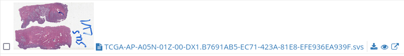
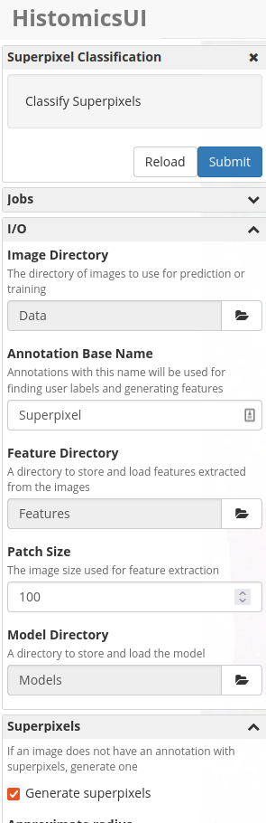

==============================
WSI Superpixel Guided Labeling
==============================

WSI Superpixel Guided Labeling is a `Girder 3 <https://github.com/girder>`_ plugin designed to be used in conjunction with `HistomicsUI <https://github.com/DigitalSlideArchive/HistomicsUI>`_ and `HistomicsTK <https://github.com/DigitalSlideArchive/HistomicsTK>`_ to facilitate active learning on whole slide images.

This plugin leverages the output of certain HistomicsTK/SlicerCLI jobs to allow end users to label superpixel regions of whole slide images to be used as input for machine learning algorithms.

An example algorithm is contained within the ``dsarchive/superpixel:latest`` docker image. This can be used to generate superpixels, features, and machine learning models for active learning on a directory of images. See the installation instructions below for how to include the image as part of your Digital Slide Archive deployment.

Once the appropriate data is generated, a new view becomes available for labeling and retraining.

Installation
------------

The recommended way to use this plugin is by adding it to the Digital Slide Archive's ``docker-compose`` deployment. First, check out both this repositor and ``digital_slide_archive`` from Github, if you do not yet have a running instance of the Digital Slide Archive.

If you don't already use a provisioning yaml file as part of your DSA deployment, you'll want to create one, e.g. ``provision.local.yaml``. Make sure this file contains the following: ::

    pip:
        - /opt/wsi-superpixel-guided-labeling
    rebuild-client: True
    resources:
        - model: collection
          name: "Active Learning"
          creator: resource:admin
          public: True
        - model: folder
          parent: "resource:collection/Active Learning"
          parentType: collection
          name: Data
          creator: resource:admin
          public: True
        - model: folder
          parent: "resource:collection/Active Learning/Data"
          parentType: folder
          name: Annotations
          creator: resource:admin
          public: True
        - model: folder
          parent: "resource:collection/Active Learning/Data"
          parentType: folder
          name: Models
          creator: resource:admin
          public: True
        - model: folder
          parent: "resource:collection/Active Learning/Data"
          parentType: folder
          name: Features
          creator: resource:admin
          public: True
    slicer-cli-image:
        - dsarchive/histomicstk:latest
        - dsarchive/superpixel:latest

In ``digital_slide_archive/devops/dsa/``, you'll want to add or modify ``docker-compose.override.yaml`` in the following manner: ::

    ---
    version '3'
    services:
        girder:
            environment:
                DSA_PROVISION_YAML: ${DSA_PROVISION_YAML:-/opt/digital_slide_archive/devops/dsa/provision.yaml}
            volumes:
                - ./provision.local.yaml:/opt/digital_slide_archive/devops/dsa/provision.yaml
                - <path>/<to>/wsi-superpixel-guided-labeling:/opt/wsi-superpixel-guided-labeling

Where ``<path>/<to>/wsi-superpixel-guided-labeling`` is the path to this directory. These changes mount the source code for this plugin to the docker container so the plugin can be built. It also ensures the provisioning yaml will be used to install the plugin and perform some initial setup.

In the same directory, run ``DSA_USER=$(id -u):$(id -g) docker-compose up``. Once the deployment is stood up, you can verify that everthing has been provisioned correctly by visiting ``localhost:8080``.

To verify, login as the provisioned admin user and check that the "WSI Superpixel Guided Labeling" plugin is installed by navigating to the Admin console from the sidebar and clicking "Plugins." Additionally there should be a collection called "Active Learning", which should contain one folder called "Data", which in turn should contain folders "Annotations," "Features," and "Models."

Using the Plugin
----------------

After following the installation instructions, you should have a folder called **Data** in a collection called **Active Learning**, which looks like the following:

.. image:: docs/screenshots/active_learning_folder.png
   :alt: Active Learning/Data folder after provision

To enable launching the Active Learning UI from the folder, you'll need to set metadata on the folder. You can do this from here by clicking the blue plus button in the metadata header, selected ``Simple``, and adding the following metadata property.

.. image:: docs/screenshots/active_learning_metadata.png
   :alt: Metadata to add. Key: active_learning, Value: true

Upload the whole slide images you'd like to use for active learning to this folder, using the green upload button. Then, open any of the images in HistomicsUI using the link next to the image name.

Next we will generate the superpixel features and pixelmap images using the slicer CLI image. From the HistomicsUI page, click on ``Analyses`` at the top right of the page. Then click ``dsarchive/superpixel > latest > SuperpixelClassification``. Look at the sidebar, which allows you to set the parameters for the Superpixel Classification algorithm. *Image Directory*, *Feature Directory*, *Model Directory*, and *Annotation Directory* should be automatically populated. You can change the value of *Labels* to reflect what you are trying to classify in your images. Check the *Random Input* box to start with some initial labels. Scroll up and click ``Submit``. Depending on the host machine and the number and size of images, this job could take some time.

Once the job is complete, return to the **Data** folder, and click the ``Active Learning`` button in the top right.

.. image:: docs/screenshots/active_learning_view.png
   :alt: The active learning view

From here, you can label superpixel features using the film strip area at the bottom to retrain the model. Each block of the film strip depicts one superpixel. The bar at the top of each block shows the most recent prediction. Hovering over this section shows the confidence of that prediction. The superpixels shown are sorted so that users are shown the least confident predictions first. Users can add a label by either agreeing or disagreeing by using the radion buttons. If disagree is chosen, the drop down menu becomes active, and users can add a label by selecting the correct category from the drop down menu.

In order to clear all user inputs on this screen , a ``Reset All`` button is provided. If the predictions for all of the visible blocks matches the actual class of the regions shown, there is an ``Agree to All`` button. You can also view a color-coded pixelmap of the current batch of predictions by clicking the ``Show/hide Predictions`` button.

After labeling some superpixels, a retrain can be triggered with the ``Retrain`` button. This will kick off a job to generate a new batch of predictions, using the newly created labels as input. This job should not take as long as the first, since superpixel and feature generation only needs to be performed once. While that job is running, interactions with this view are disabled. Once the job is finished, new superpixels will be shown to the user for labeling.

Features
--------

* Adds a new view which can be accessed from the Girder 3 UI for folders that are configured for this workflow
