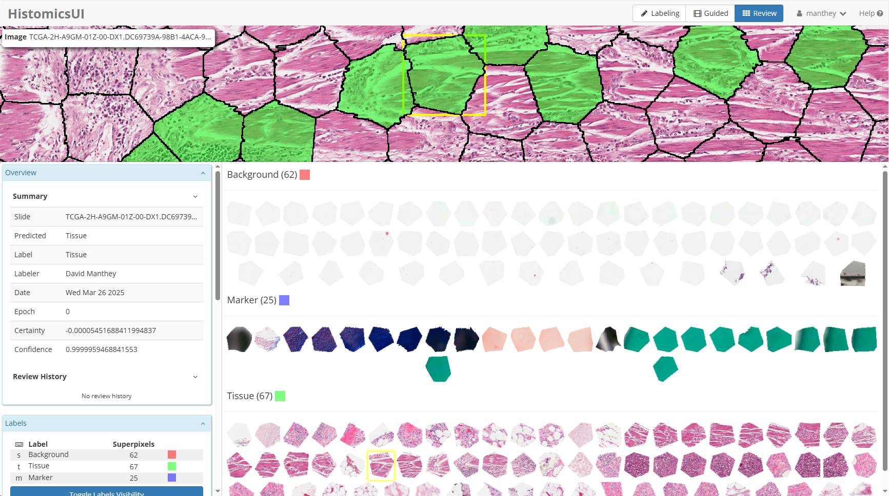

# Summary

`WSI Superpixel Guided Labeling` facilitates active learning on whole slide images.  It has a user interface built on top of the HistomicsUI [@histomicsui] base and deployed as part of the Digital Slide Archive [@Gutman2017, @digitalslidearchive], and uses the HistomicsTK [@histomicstk] tool kit as part of the process.

Users label superpixel regions or other segmented areas of whole slide images to be used as classification input for machine learning algorithms.  An example algorithm is included which generates superpixels, features, and machine learning models for active learning on a directory of images.  The interface allows bulk labeling, labeling the most impactful superpixels to improve the model, and reviewing labeled and predicted categories.

# Statement of need

One of the limitations in generating accurate models is the need for labeled data.  Given a model and a few labeled samples, there are a variety of algorithms that can be used to determine what samples should be additionally labeled to most efficiently improve the model.  To actually get labeled data, this prediction of which samples to label needs to be combined with an efficient workflow so that the domain expert can use their labeling time in the most effective manner possible.

`WSI Superpixel Guided Labeling` provides a user interface and workflow for this guided labeling process.  Given a set of whole slide images, the images are segmented based on a some user choices.  This segmentation is the basis for labeling.  The user can specify any number of label categories, including labels that will be excluded from training (for instance, for segmented regions whose categories cannot be accurately determined).  After labeling a few initial segments, a model is generated and used to both predict the category of all segments and the segments that would result in the best improvement in the model if they were also labeled.  The user can retrain the model at any time and review the results of both the predictions and other users.

For development, the initial segmentation uses superpixels generated with the SLIC [@SLIC2012] algorithm.  These are computed on whole slide images in a tiled manner so that they can work on arbitrarily large images, and the tile boundaries are properly handled to avoid visible artifacts.  Once generated, segments are represented in one of two ways, either as two-dimensional patches, each centered in a fixed-sized square of pixels with non-segment pixels set to black, or as one-dimensional vectors, such as those generated from the huggingface UNI [@huggingface2024uni] foundation model.  One of two basic models is trained based upon the segment representation.  For two-dimensional patches, the model to be trained is a small-scale CNN implemented in tensorflow/keras or torch.  For one-dimensional vectors, the model to be trained is a single-layer linear classifier.  The certainty criteria for which segments should be labeled next can also be selected, and includes confidence, margin, negative entropy, and the BatchBALD [@batchbald2019] algorithm.

We had a placental pathologist provide feedback to validate the efficiency of the user interface and utility of the process.

# Basic Workflow

When starting a new labeling project, the user selects how superpixels are generated, which certainty metric is used for determining the optimal labeling order, and what features are used for model training.  The labeling mode allows defining project labels and performing initial labeling.  This mode can also be used to add new label categories or combine two categories if they should not have been distinct.  Label categories can additionally be marked as excluded, which removes them from training and ensures that superpixels with those labels are no longer suggested for labeling.

Once some segments have been labeled and an initial training process has been performed, additional segments are shown with their predictions.  The user can use keyboard shortcuts or the mouse to confirm or correct labels.  These are presented in an order that maximizes the utility of improving the model based on the originally selected certainty metric.

To check on overall behavior or correct mistakes, there is a review mode that allows seeing all labeled segments with various filtering and sorting options.  This can be used to check agreement between pathologists or determine how well the model agrees with the manually labeled data.

The whole slide image data in these figures are from data generated by the TCGA Research Network [@TCGA].

# Acknowledgements

This work has been funded in part by National Library of Medicine grant 5R01LM013523 entitled "Guiding humans to create better labeled datasets for machine learning in biomedical research".

# References
